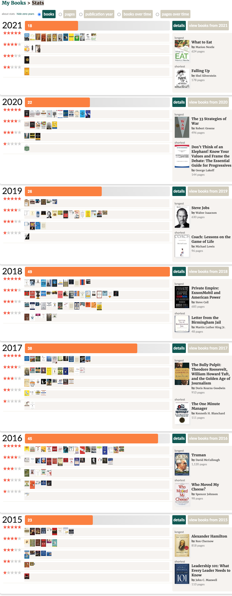

# goodreads-csv-to-md

Takes an exported Goodreads CSV and generates markdown files targeting jekyll md template

They[citation needed](https://xkcd.com/285/) say the brain can't tell the difference between audio books and physical books, majority of this list was consumed via audioCD during my commute to/from work.

### Steps to export

1. [Export your goodreads data](#export-of-goodreads-data) to csv
2. Modify [basic template](/md-template.md) and/or [jekyll template](/jekyll-template.md) to your hearts content
3. run ```python goodreads-csv-to-markdown.py```
    * If you're getting a ```KeyError``` it most likely means you have a misnamed ```{header}``` in your tempalte
4. Copy markdown output to new system of record

Just realized that I combined a utility script with my own data. So probably fork and replace data.

## Very manual process

https://www.goodreads.com/api as of 2024 states there is no longer active support for api keys and directs to https://help.goodreads.com/s/article/Does-Goodreads-support-the-use-of-APIs which directs users to use the [account data export feature](#export-of-goodreads-data).

> As of December 8th 2020, Goodreads no longer issues new developer keys for our public developer API and plans to retire the current version of these tools. You can find more information 

For now I generate a goodreads URL using the `Book Id` column.

`https://www.goodreads.com/book/show/{Book Id}`

## Export of Goodreads data

Had fun tracking my books at [goodreads.com](https://www.goodreads.com) but I wanted to consolidate my data to the one true overlord MSFT and use it as content for my [personal site](https://jsrowe.com) hosted at [jsr6720.github.io](https://github.com/jsr6720/jsr6720.github.io).

The [goodreads_library_export_original.csv](./goodreads_library_export_original.csv) was generated from [Account Settings Page](https://help.goodreads.com/s/article/How-do-I-get-a-copy-of-my-data-from-Goodreads). I discovered some data that was easier for me clean up via goodreads UI so I [re-exported](./goodreads_library_export.csv) it for use with this script. Specifically the deleting of books from the "Want to read" bookshelf.

## Goodreads account data

Copied from the account settings/profile page. I joined in May 2016. Prior to this I was tracking books on some now lost google sheet stored on an old google drive account.

232 ratings (3.88 avg) with 219 reviews. I guess maybe I don't like what I pick.

FAVORITE GENRES: Biography, Business, Classics, History, Non-fiction, Philosophy, and Psychology

## Screenshot of stats



## Licenses

[CC0 1.0 Universal LICENSE](/LICENSE) Covers all written content in exports and resulting templates. This content was previously available on my public [goodreads](https://www.goodreads.com) account.

[MIT License](/CODE-LICENSE) Covers the code within this repo. Heavily assisted by ChatGPT 3.5